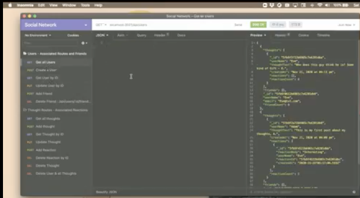

<h1 align="center">social-network-API</h1>
  
<p align="center">
    
    
    
    
    
    
</p>
   
## Description

🔍 API backend required for a social networking application supported with NoSQL MongoDB and Mongoose JS library, API routes from Express.js server, and routes tested via Insomnia app.<br>
* This API is for a social networking application, where users can create a list of friends, post their thoughts, then react to one other's thoughts. 
* Users may edit or delete own thoughts.
* Node.js based API uses Express.js for routing, MongoDB for data storage for NoSQL backend database, Mongoose Object Data Management (ODM) system to create and manage the database queries upon startup, and Moment.js npm package to format any time dependent aspects of the application.
* Readme.md includes a walkthrough of the backend functionality of the code required by a website to provide large amounts of unstructured data. 
* The walkthrough listed under the TOC Usage, shows the application if it were cloned to a localhost:3001 and started at the Node.js commandline, with the API endpoints viewed through Insomnia application. 
* Invoking the application at the terminal, JavaScript begins with the start up of the Express.js server then creates the Mongoose table models, syncing to the MongoDB backend. 
* You can view the API routes and JSON output shown when a user is created, their friends are added to their lists, and their thoughts,  reactions to their friends' thoughts are added, updated or removed - essentially the social interaction of a group of friends.

💻 Below shows the functionality of the application via insomnia and can be found within my google drive: Inclusive of the Bonus - Remove a User and all their Thoughts!

[](https://drive.google.com/file/d/1uwleLXhmm0jrK-LNB2EoF5RIW18-yIto/view?usp=sharing)
   

## User Story

```
AS A social media startup
I WANT an API for my social network that uses a NoSQL database
SO THAT my website can handle large amounts of unstructured data
```

## Acceptance Criteria

```
GIVEN a social network API
WHEN I enter the command to invoke the application
THEN my server is started and the Mongoose models are synced to the MongoDB database
WHEN I open API GET routes in Insomnia Core for users and thoughts
THEN the data for each of these routes is displayed in a formatted JSON
WHEN I test API POST, PUT, and DELETE routes in Insomnia Core
THEN I am able to successfully create, update, and delete users and thoughts in my database
WHEN I test API POST and DELETE routes in Insomnia Core
THEN I am able to successfully create and delete reactions to thoughts and add and remove friends to a user’s friend list
```
   
## Table of Contents
- [Description](#description)
- [Acceptance Criteria](#acceptance-criteria)
- [Table of Contents](#table-of-contents)
- [Installation](#installation)
- [Usage](#usage)
- [Testing](#testing)
- [Contributing](#contributing)
- [Questions](#questions)

## Installation
💾 
- Prereq: install VSCode, Node.js
- After cloning the GitHub repo to your local drive, run the following in the VSCode command-line terminal
- Install all components listed within the package.json file for npm
- $ npm i
- For custom installations, start with initializing npm
- $ npm init -y or $ npm install
- Install npm express, more info https://www.npmjs.com/package/express
- $ npm install express
- Manually update the package.json to "main": "server.js", instead of index.js
- Create a .gitignore file in the root and add node_modules to this file
- If you need to re-add the dependencies, run $ npm install
- Install MongoDB, first create a c:/data/db directory on your root, then install the Community Server from<br> https://www.mongodb.com/try/download/community, excluding the compass from the installation, and adding the /bin folder to the environment variable PATH.
- Install the MoongooseJS library
- $ npm install mongoose
- Install npm Moment.js
- $ npm install moment
  
## Usage
💻   
- If this application is cloned from github, complete the installation npm i, then start up at commandline, by typing:
- $ npm start

## Testing
For testing the API routes locally, use Insomnia application to view GET, POST, PUT, DELETE API routes


### Future Enhancements
```
Ability to view with a front end on browser

```

## Contributing
:octocat: [Jenifer Queen](https://queen-stack.github.io/profile/)

## Questions
✉️ Contact me with any questions: [email](mailto:jenf_queen@yahoo.com) , [GitHub](https://github.com/queen-stack)<br/>


